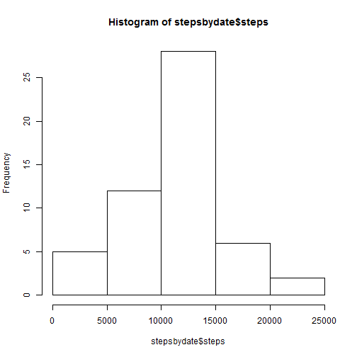
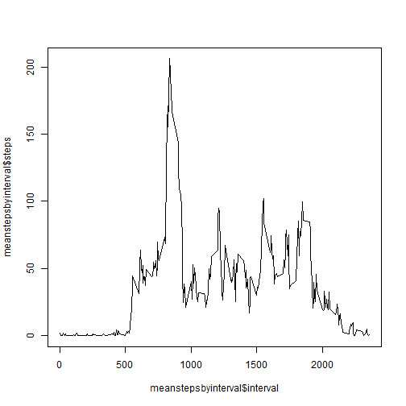
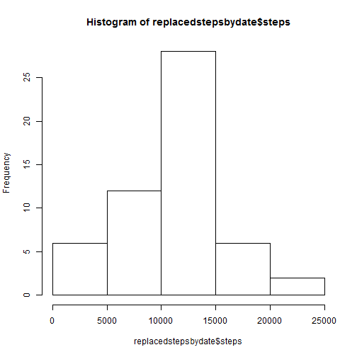
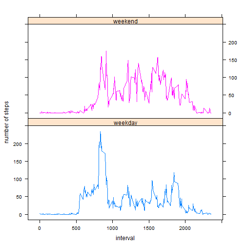

##Loading and preprocessing the data


```r
activitydata <- read.csv(unz("activity.zip", "activity.csv"))
stepsbydate <- aggregate(steps ~ date, data = activitydata, FUN = "sum")
```

## What is mean total number of steps taken per day?

```r
hist(stepsbydate$steps)
```

 
the mean steps by day is

```r
mean(stepsbydate$steps)
```

```
## [1] 10766.19
```
The median steps by day is

```r
median(stepsbydate$steps)
```

```
## [1] 10765
```

## What is the average daily activity pattern?

```r
meanstepsbyinterval <- aggregate(steps ~ interval, data = activitydata, FUN = "mean")
```

Time series plot

```r
plot(meanstepsbyinterval$interval, meanstepsbyinterval$steps, type = "l")
```

 

Average 5-minute interval, on average across all the days in the dataset, that contains the maximum number of steps

```r
maxstepsbyinterval <- subset(meanstepsbyinterval,steps == max(meanstepsbyinterval$steps))
maxstepsbyinterval$interval
```

```
## [1] 835
```

## Imputing missing values
###Missing values
The total number of missing values in the dataset (i.e. the total number of rows with NAs)


```r
sum(is.na(activitydata$steps))
```

```
## [1] 2304
```

###strategy for filling in missing values
Missing values filled in by using the median for that interval. This was selected to avoid unusual days undually influencing the data/ 

New data set created


```r
medianstepsbyinterval <- aggregate(steps ~ interval, data = activitydata, FUN = "median")
replacedactivitydata <- activitydata
for (i in 1:length(replacedactivitydata)) {
  if(is.na(replacedactivitydata$steps[i])) {
    replacedactivitydata$steps[i] <- medianstepsbyinterval$steps[replacedactivitydata$interval/5+1] 
  }
}
```

```
## Warning in replacedactivitydata$steps[i] <-
## medianstepsbyinterval$steps[replacedactivitydata$interval/5 + : number of
## items to replace is not a multiple of replacement length
```

```
## Warning in replacedactivitydata$steps[i] <-
## medianstepsbyinterval$steps[replacedactivitydata$interval/5 + : number of
## items to replace is not a multiple of replacement length
```

```
## Warning in replacedactivitydata$steps[i] <-
## medianstepsbyinterval$steps[replacedactivitydata$interval/5 + : number of
## items to replace is not a multiple of replacement length
```

## Are there differences in activity patterns between weekdays and weekends?

```r
replacedstepsbydate <- aggregate(steps ~ date, data = replacedactivitydata, FUN = "sum")
```

Histogram

```r
hist(replacedstepsbydate$steps)
```

 
the mean steps by day in the replaced data is

```r
mean(replacedstepsbydate$steps)
```

```
## [1] 10566.81
```
The median steps by day in the replaced is

```r
median(replacedstepsbydate$steps)
```

```
## [1] 10682.5
```

There is a small decrease in the number of steps per day.

##differences in activity patterns between weekdays and weekends

Adding exploration of weekdays versus weekends

```r
weekpart <- weekdays(as.Date(replacedactivitydata$date))
for (i in 1:length(weekpart)) {
  if (weekpart[i] %in% c('Saturday','Sunday')) {
    weekpart[i] <- "weekend"
  } else {
    weekpart[i] <- "weekday"
  }
}
replacedactivitydata$weekpart <- as.factor(weekpart)
```

Time series plot

```r
meanreplacedstepsbyinterval <- aggregate(steps ~ interval + weekpart, data = replacedactivitydata, FUN = "mean")


library(lattice)

xyplot(steps ~ interval|  weekpart, 
           data = meanreplacedstepsbyinterval,
       groups = meanreplacedstepsbyinterval$weekpart,
           type = "l",
           xlab = "interval",
           ylab = "number of steps",
           layout=c(1,2))
```

 
